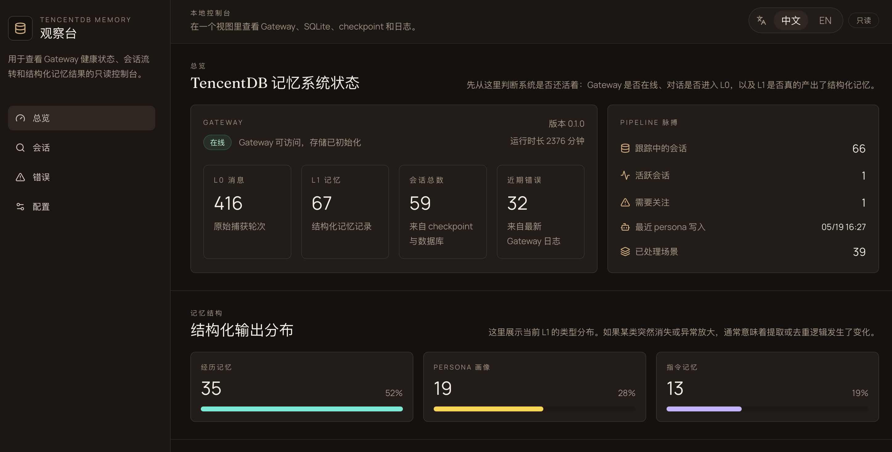
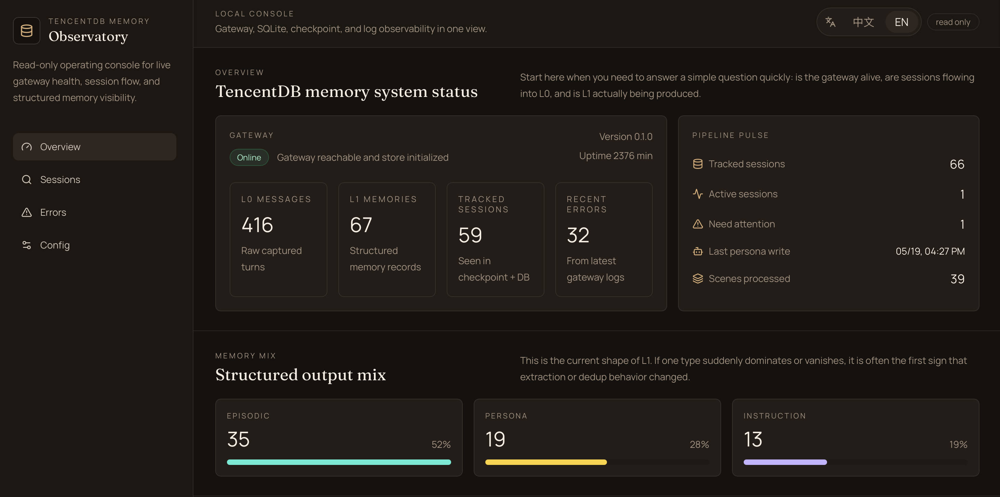
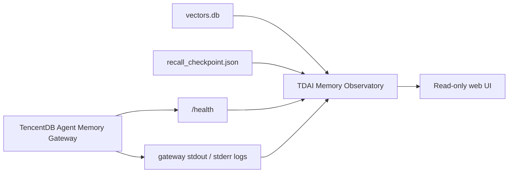

# TDAI Memory Observatory

> Read-only observability console for local [TencentDB Agent Memory](https://github.com/Tencent/TencentDB-Agent-Memory) deployments.
>
> 让你看清记忆系统正在做什么，而不是只能猜它有没有工作。


TDAI Memory Observatory is a local-first web console for debugging and understanding a live TencentDB Agent Memory pipeline. It reads your existing memory store, gateway health endpoint, checkpoint metadata, and logs, then turns them into a calm operational surface for session flow, L0 to L1 progress, error patterns, and runtime state.

This project is inspired by the layered-memory ideas in the official TencentDB Agent Memory repository, but focuses on the missing observability layer: what entered L0, what reached L1, what is lagging, and what silently failed.

## Screenshots

| Chinese UI | English UI |
| --- | --- |
|  |  |

## Why This Exists

The official TencentDB Agent Memory project is about building layered memory. This project is about making that system inspectable in daily use.

Without observability, the most common questions are frustratingly hard to answer:

- Did this session get captured at all?
- Why does this session still have no L1?
- Is the gateway alive or just quietly degraded?
- Is recall failing because of logs, embeddings, checkpoints, or extraction?

TDAI Memory Observatory is built to answer those questions quickly, with a read-only interface that stays close to the live data.

## What It Shows

- Gateway health and uptime
- L0, L1, and tracked session counts
- Session-level status: healthy, lagging, empty, attention
- More specific reason text under each status badge
- Grouped error patterns from gateway logs
- Sanitized runtime configuration
- Checkpoint and filesystem bindings
- Bilingual UI with Chinese and English switching

## Pages

| Page | Purpose |
| --- | --- |
| `Overview` | Health, counts, pipeline pulse, recent sessions, grouped error signals |
| `Sessions` | Searchable session list with L0/L1 counts, cursor state, and explanation text |
| `Session Detail` | Raw L0 rows, structured L1 rows, checkpoint state, session-specific logs |
| `Errors` | Recent non-info log entries grouped by operational meaning |
| `Config` | Sanitized config, local paths, checkpoint summary |

## Read-Only Guarantee

This UI is intentionally read-only.

- It does **not** write to `vectors.db`
- It does **not** mutate `l0_conversations`, `l1_records`, or checkpoint files
- It does **not** change gateway behavior
- It only reads local files, the SQLite store, and the gateway `/health` endpoint

That makes it safe to run alongside your actual memory workflow.

## Architecture



## Data Sources

By default, the app reads:

- `vectors.db`
- `.metadata/recall_checkpoint.json`
- `tdai-gateway.json`
- `logs/gateway.stdout.log`
- `logs/gateway.stderr.log`
- `http://127.0.0.1:8420/health`

All of those are configurable through environment variables, and the data directory plus gateway URL can also be overridden from the in-app `Config` page and saved per browser.

## Quick Start

### 1. Install dependencies

```bash
npm install
```

### 2. Copy local environment settings

```bash
cp .env.example .env.local
```

### 3. Start the app

For development:

```bash
npm run dev
```

For a steadier local runtime:

```bash
npm run build
npm run start
```

Then open:

[http://localhost:3000](http://localhost:3000)

### 4. Optionally override runtime inputs in the UI

Open the `Config` page if you want to point the observatory at a different:

- TencentDB memory data directory
- Gateway base URL

Those values are saved in browser-scoped cookies, so they survive refreshes without mutating your actual memory store.

## Environment

`.env.example` includes the two main inputs:

```bash
TDAI_DATA_DIR=/absolute/path/to/your/memory-tdai
TDAI_GATEWAY_URL=http://127.0.0.1:8420
```

Variables:

- `TDAI_DATA_DIR`: local TencentDB memory data directory
- `TDAI_GATEWAY_URL`: gateway base URL used for `/health`

Precedence:

1. Values saved in the `Config` page
2. Environment variables
3. Built-in defaults (`~/.memory-tencentdb/memory-tdai` and `http://127.0.0.1:8420`)

## Notes

- Secrets from `tdai-gateway.json` are masked before rendering.
- The UI supports Chinese and English switching in the header.
- Session states intentionally separate badge category from explanation text, so the compact status stays scannable while the detail remains useful.
- On some setups, development mode can be less stable than production mode when using `node:sqlite`; `npm run start` is recommended when you want a steadier local session.

## Tech Stack

- Next.js App Router
- TypeScript
- Tailwind CSS 4
- Server-rendered local file access
- SQLite reads via `node:sqlite`

## Related Project

- Official upstream: [Tencent/TencentDB-Agent-Memory](https://github.com/Tencent/TencentDB-Agent-Memory)

If you are looking for the memory engine itself, start there.
If you are looking for a visual operating console around it, this repository is the layer on top.

## Roadmap

- Finer-grained session states beyond the current badge categories
- Recall inspection page
- Pipeline run history page
- Optional auto-refresh for key dashboards
- More structured log drill-down
