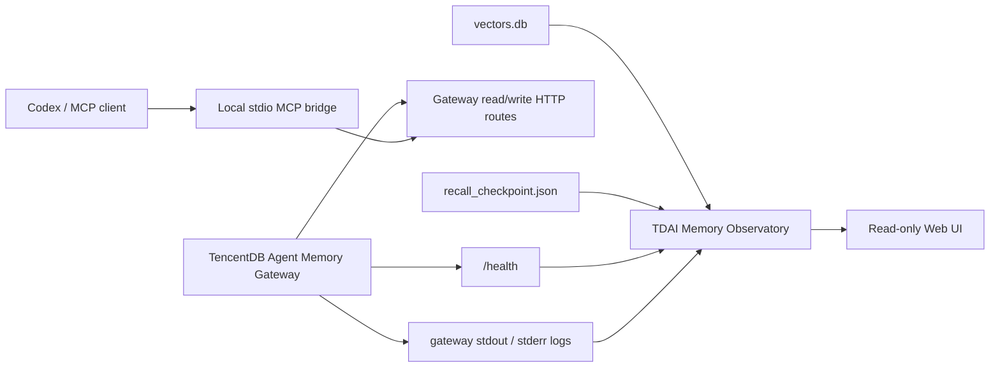

# TDAI Memory Observatory

> Read-only observability console and local MCP bridge for [TencentDB Agent Memory](https://github.com/Tencent/TencentDB-Agent-Memory).
>
> 让你看清记忆系统正在做什么，也让 Codex 能稳定接入它。


TDAI Memory Observatory is a local-first companion project for TencentDB Agent Memory. It adds the layer that is usually missing in day-to-day use:

- a calm web console for session flow, L0 to L1 progress, checkpoint lag, and grouped errors
- a local stdio MCP bridge so Codex can read and write memory through the existing Gateway

The UI stays read-only. The MCP bridge goes through the Gateway HTTP API instead of touching SQLite directly.

## Screenshots

| Chinese UI | English UI |
| --- | --- |
|  |  |

## What This Project Solves

TencentDB Agent Memory already builds layered memory. This project makes that running system inspectable and usable.

Typical questions it helps answer:

- Did this conversation enter L0 at all?
- Why does this session still have no L1?
- Is the Gateway alive or just quietly degraded?
- Is the issue in extraction, checkpoint progress, embeddings, or logs?
- Can Codex use the same local memory system without custom database code?

## Features

### Web observability console

- Gateway health and uptime
- L0, L1, and tracked session counts
- Session-level status badges with more specific explanatory text
- Session detail view for raw L0 rows, L1 rows, checkpoint state, and session logs
- Grouped gateway error patterns
- Sanitized runtime configuration view
- Chinese / English language switching
- Browser-scoped runtime overrides for data directory and Gateway URL

### Local MCP bridge

- `tdai_health`
- `tdai_recall`
- `tdai_capture`
- `tdai_search_memories`
- `tdai_session_end`

These tools forward to the running TencentDB memory Gateway on your machine.

## Read-only boundary

The browser UI is intentionally read-only.

It does **not**:

- write to `vectors.db`
- modify `l0_conversations`, `l1_records`, or checkpoint files
- edit the live gateway config on disk
- mutate memory content directly

It only reads local files plus the Gateway `/health` endpoint.

The MCP bridge is the only write-capable part of this repo, and even that writes **through the Gateway** rather than editing the database itself.

## Architecture



## Default data sources

By default, the UI reads:

- `vectors.db`
- `.metadata/recall_checkpoint.json`
- `tdai-gateway.json`
- `logs/gateway.stdout.log`
- `logs/gateway.stderr.log`
- `http://127.0.0.1:8420/health`

All of these can be overridden without changing the upstream TencentDB memory project.

## Requirements

- Node.js 20+
- A local TencentDB Agent Memory deployment that already has a data directory and Gateway
- A running Gateway if you want health checks or MCP usage

Typical defaults:

- data directory: `~/.memory-tencentdb/memory-tdai`
- Gateway: `http://127.0.0.1:8420`

## Installation

```bash
npm install
```

Copy the example environment file if you want explicit local defaults:

```bash
cp .env.example .env.local
```

## Running the web UI

### Development mode

```bash
npm run dev -- --port 3000
```

### Production-style local mode

```bash
npm run build
npm run start -- --port 3000
```

Then open:

[http://localhost:3000](http://localhost:3000)

## Runtime configuration

### Environment variables

This repo supports three main runtime inputs:

```bash
TDAI_DATA_DIR=/absolute/path/to/your/memory-tdai
TDAI_GATEWAY_URL=http://127.0.0.1:8420
TDAI_MCP_GATEWAY_URL=http://127.0.0.1:8420
```

Meaning:

- `TDAI_DATA_DIR`: local TencentDB memory data directory for the UI
- `TDAI_GATEWAY_URL`: Gateway base URL used by the UI for `/health`
- `TDAI_MCP_GATEWAY_URL`: Gateway base URL used by the MCP bridge

### Browser-side Config page

The `Config` page can override two values for the UI only:

- data directory
- Gateway URL

These values are saved in browser-scoped cookies, so they survive refreshes.

Important:

- browser-side overrides affect the **UI only**
- they do **not** reconfigure the MCP bridge process
- the MCP bridge follows command-line args and environment variables instead

### Effective precedence

For the UI:

1. values saved in the `Config` page
2. environment variables
3. built-in defaults

For the MCP bridge:

1. `--gateway-url`
2. `TDAI_MCP_GATEWAY_URL`
3. `TDAI_GATEWAY_URL`
4. `http://127.0.0.1:8420`

## MCP bridge

The MCP bridge lives at:

[`mcp/server.mjs`](mcp/server.mjs)

It is designed for local Codex usage against a TencentDB memory Gateway already running on your machine.

### Start the MCP bridge

Default target:

```bash
npm run mcp
```

Explicit target:

```bash
node ./mcp/server.mjs --gateway-url http://127.0.0.1:8420
```

### Supported tools

| Tool | Gateway route | Mode | Purpose |
| --- | --- | --- | --- |
| `tdai_health` | `GET /health` | read | Check whether the local Gateway is online |
| `tdai_recall` | `POST /recall` | read | Recall structured memory for a stable `session_key` |
| `tdai_capture` | `POST /capture` | write | Write one user/assistant turn into L0 and notify the scheduler |
| `tdai_search_memories` | `POST /search/memories` | read | Search L1 memories directly for inspection and debugging |
| `tdai_session_end` | `POST /session/end` | write | Flush the current session when a task is wrapping up |

### Codex configuration

For Codex Desktop / CLI, add a server block to `~/.codex/config.toml`:

```toml
[mcp_servers.tdai_memory]
command = "/opt/homebrew/bin/node"
args = ["/absolute/path/to/tdai-memory-observatory/mcp/server.mjs", "--gateway-url", "http://127.0.0.1:8420"]
startup_timeout_sec = 120
enabled = true

[mcp_servers.tdai_memory.env]
TDAI_MCP_GATEWAY_URL = "http://127.0.0.1:8420"
```

Notes:

- using an absolute Node path is safer on macOS than relying on GUI PATH inheritance
- after editing `config.toml`, restart Codex or open a fresh CLI session

### Recommended `session_key` convention

Keep `session_key` stable by project and topic. For example:

- `codex:TencentDB-Agent-Memory:mcp-design`
- `codex:TencentDB-Agent-Memory:gateway-debug`
- `codex:tdai-memory-observatory:ui-polish`

Avoid generating a new random `session_key` every turn, or memory continuity will fragment.

### Suggested tool-call rhythm

1. call `tdai_health` before a substantial task starts
2. call `tdai_recall` when the answer depends on prior context
3. call `tdai_capture` after a useful user/assistant turn completes
4. call `tdai_session_end` when the task or thread is wrapping up

## Verified end-to-end behavior

This bridge has been verified locally against a live TencentDB memory Gateway with real Codex CLI calls.

Confirmed working:

- `tdai_health` returning Gateway health JSON
- `tdai_search_memories` returning stored memory content from the local database through the Gateway

The bridge now supports both common stdio encodings used by MCP clients:

- framed transport with `Content-Length`
- newline-delimited JSON messages

That compatibility matters for recent Codex builds.

## Troubleshooting

### `tdai_memory` times out during startup

If Codex reports something like:

- `MCP client for tdai_memory timed out after 120 seconds`
- `MCP startup incomplete`

check these first:

1. make sure you are on a version of this repo that includes the updated `mcp/server.mjs`
2. confirm the Gateway itself is alive:

```bash
curl http://127.0.0.1:8420/health
```

3. verify the Codex MCP config points at the correct script path
4. prefer an absolute Node path in `config.toml`
5. restart Codex after changing the MCP config

### The UI works, but MCP points somewhere else

This is possible.

Remember:

- the UI can be overridden from the browser `Config` page
- the MCP bridge is configured separately by env vars or command-line args

Check the `MCP` page in the UI to compare:

- UI binding
- MCP target

### Codex CLI prints unrelated skill warnings

You may see local warnings about broken third-party skill YAML files under `~/.agents/skills`.
Those warnings are noisy, but they are not necessarily MCP failures.

If `tdai_health` or `tdai_search_memories` still complete successfully, the MCP bridge is working.

### Development mode feels less stable than production mode

On some setups, `next dev` is less steady than `next start` when `node:sqlite` is involved.
If you just want a reliable local session, prefer:

```bash
npm run build
npm run start -- --port 3000
```

## Pages

| Page | Purpose |
| --- | --- |
| `Overview` | Health, counts, pipeline pulse, recent sessions, grouped error signals |
| `Sessions` | Searchable session list with L0/L1 counts, cursor state, and explanation text |
| `Session Detail` | Raw L0 rows, structured L1 rows, checkpoint state, session-specific logs |
| `Errors` | Recent non-info log entries grouped by operational meaning |
| `MCP` | Local Codex bridge status, tool surface, launch commands, and config snippets |
| `Config` | Sanitized config, local paths, checkpoint summary |

## Tech stack

- Next.js App Router
- TypeScript
- Tailwind CSS 4
- `node:sqlite`
- local file access on the server side
- a lightweight Node-based stdio MCP bridge

## Related project

- Official upstream: [Tencent/TencentDB-Agent-Memory](https://github.com/Tencent/TencentDB-Agent-Memory)

If you are looking for the memory engine itself, start there.
If you are looking for a visual operating console and Codex bridge around it, this repository is the layer on top.

## Roadmap

- recall inspection page
- pipeline run history page
- optional auto-refresh for key dashboards
- more structured log drill-down
- carefully scoped maintenance actions through explicit jobs
